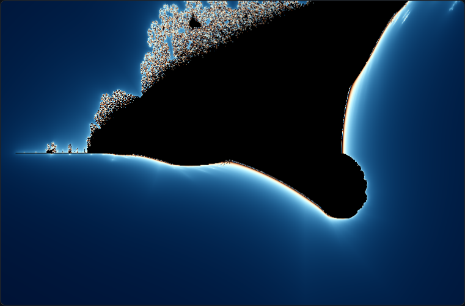
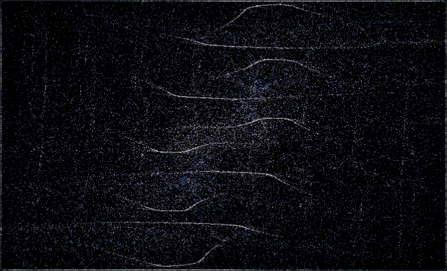
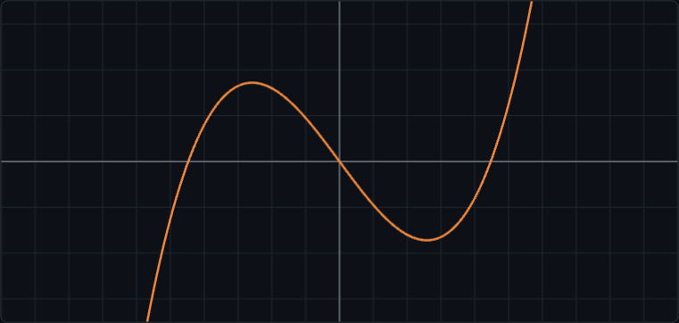

# nim-wasm-forkware

**Documents that carry their own compiler.** Each `.html` file here is a working
app, its own source code, *and* a real [Nim](https://nim-lang.org) compiler that
runs entirely in your browser. Open one, disagree with how it works, edit the
**actual compiled logic** in a tab, hit **Recompile** - and the document rebuilds
itself live (Nim → C → WebAssembly, or Nim → JavaScript, all client-side). Then
**Save Fork** to download your mutated copy and pass it on. No server, no
toolchain install, no account. Call it **forkware**.

<p align="center">
  
  
</p>

## Why the stack is the point

A "recompile in the browser" demo is only interesting if the compile is *real*.
Most languages can't do this with no backend: Rust/Go playgrounds are
server-side; Python/JS "recompiling" is just interpret/`eval`. The realistic
club that can edit → **compile to genuine WebAssembly** → run, all in the tab, is
the clang family - and Nim rides on exactly that (Nim → C → `clang.wasm` →
`wasm-ld`) while giving you memory safety and real ergonomics over raw C. Nim is
also unusually positioned to write *both halves* of a forkware document: a
native-speed WASM core **and** the JS for the UI, from one language.

## The demos

| File | Backend | What it shows |
|------|---------|---------------|
| [`unitcalc.html`](unitcalc.html) | Nim → C → **WASM** | A unit-aware engineering calculator. Edit the unit table / add a formula in Nim, recompile, and the calculator changes. Dimensional algebra over the 7 SI base units catches `1 m + 1 s`. |
| [`fractal.html`](fractal.html) | Nim → C → **WASM** | A real-time fractal explorer - millions of iterations per frame (genuinely needs native code). Click to zoom; swap the iteration formula (Mandelbrot / Cubic / Burning Ship / Quartic) and recompile. |
| [`physics.html`](physics.html) | Nim → C → **WASM** | Thousands of particles integrated every frame at 60 fps. Mouse attracts/repels; fork the **force law** (gravity / inverse-cube / spring / vortex) and recompile. |
| [`nimplot.html`](nimplot.html) | Nim → **JavaScript** | A live function plotter using Nim's *other* backend - `nim js` emits JavaScript that draws straight to the canvas via the DOM. Recompiles in ~1 s. |

<p align="center">
  
  
</p>

## Running it

The browser compiler is ~68 MB of prebuilt WebAssembly (the Nim compiler, clang,
lld, a sysroot). It is **not** bundled in the HTML - it lives in a sibling
`toolchain/` folder, so the documents stay small and passable. Fetch it once,
then serve over `http://` (not `file://`, which blocks modules/WASM):

```bash
git clone https://github.com/mageaustralia/nim-wasm-forkware.git
cd nim-wasm-forkware
./fetch-toolchain.sh          # downloads toolchain/ (~68 MB, once)
python3 -m http.server 8000   # must be http://, not file://
# open http://localhost:8000/fractal.html  (or unitcalc / physics / nimplot)
```

First load downloads + caches the toolchain and compiles the embedded engine
(tens of seconds). After that, recompiles are quick (1-4 s) and the app is live.
A saved fork works the same way - drop it next to the same `toolchain/` folder.

> **Can I just double-click the file?** No - `file://` blocks ES modules,
> `fetch()`, and WASM streaming, so the compiler can't load. Any local static
> server (`python3 -m http.server`) fixes it; `localhost` is a proper origin.

## How it works

```
your edited Nim  ─▶  nim.wasm (Nim→C)  ─▶  clang.wasm (C→obj)  ─▶  wasm-ld  ─▶  app.wasm  ─▶  run
```

The shell drives the compiler entirely client-side, then instantiates the
resulting `app.wasm` with a small built-in **WASI shim** and calls the engine's
**custom exports** (e.g. `render`, `step`, `evalBuf`) per frame - so panning,
zooming, and evaluating never recompile; only editing the source does.

One non-obvious detail worth stealing: `--export-dynamic` alone does **not**
surface Nim's `{.exportc.}` functions as WebAssembly exports through this
pipeline - they get stripped. Forcing them with clang's `export_name` attribute
via Nim's `codegenDecl` is what makes the live calls work:

```nim
proc evalBuf(n: cint): cint {.exportc, used,
    codegenDecl: "__attribute__((export_name(\"evalBuf\"), used)) $# $#$#".} =
  ...
```

The fork loop itself is [TiddlyWiki](https://tiddlywiki.com)-style: the engine
source lives in a non-executed `<script type="text/x-nim">` block; **Save Fork**
rewrites just that block into a fresh copy of the document and downloads it.

## Files

| File | What |
|------|------|
| `unitcalc.html` `fractal.html` `physics.html` `nimplot.html` | The forkware documents (app + Nim engine + shell + compiler bridge). |
| `engine.nim` | Standalone copy of `unitcalc`'s embedded engine, for offline reading/editing. |
| `fetch-toolchain.sh` | Mirrors the Nim→WASM toolchain into `toolchain/`. |
| `screenshots/` | Reference captures used in this README. |

## Credits & license

The in-browser Nim 2.2.4 → C → WebAssembly toolchain is
**[benagastov/Nim-WASM-Compiler](https://github.com/benagastov/Nim-WASM-Compiler)** -
the piece that makes "edit → recompile → running, all client-side" possible. This
project wraps that compiler in the forkware model.

The forkware documents and tooling in this repo are released under the
[MIT License](LICENSE). The fetched compiler toolchain is third-party and
distributed under its own license (see the upstream project).
